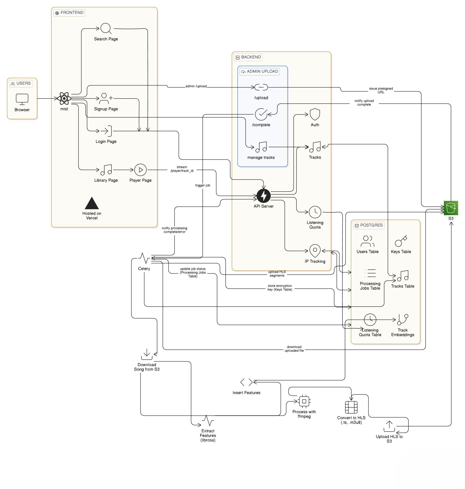

# MIST: Music Streaming Platform

A full-stack web application implementing secure, scalable music streaming with HTTP Live Streaming (HLS) protocol and asynchronous audio processing.

## Architecture

The system implements a distributed architecture with the following components:

- **Frontend**: React 19 SPA with TypeScript, HLS.js for adaptive streaming, Zustand for state management
- **Backend**: FastAPI with async request handling, SQLAlchemy ORM for PostgreSQL integration
- **Task Queue**: Celery workers with Redis broker for asynchronous audio processing
- **Storage**: AWS S3 for static asset delivery with direct public access and CORS configuration
- **Database**: PostgreSQL with pgvector extension for audio feature embeddings

## Core Features

### 1. Adaptive Bitrate Streaming
Audio files are transcoded to HLS format using FFmpeg, generating multiple quality variants (64kbps, 128kbps, 192kbps) with MPEG-TS segments and M3U8 playlists. The client implements HLS.js with custom loaders for seamless playback and bandwidth adaptation.

### 2. Content Security
- **Encryption**: AES-128 encryption applied during HLS conversion with track-specific 16-byte keys
- **Authentication**: JWT-based access control with role-based authorization (user/admin)
- **Key Management**: Encryption keys stored in PostgreSQL, served through authenticated endpoints
- **Rate Limiting**: IP-based throttling on key retrieval endpoints

### 3. Audio Processing Pipeline
Celery workers execute the following tasks asynchronously:
1. Format normalization and validation
2. Multi-bitrate HLS transcoding with AES-128 encryption
3. Audio feature extraction: MFCCs, spectral centroids, chroma features, zero-crossing rate
4. Metadata parsing and database insertion
5. S3 upload with public-read ACL and proper MIME types

### 4. Analytics & Tracking
- Listening session management with heartbeat monitoring
- Per-track play count aggregation
- User listening history with temporal granularity
- Foundation for content-based recommendation system

## TODO

- [ ] Implement Redis caching for track metadata and popular songs
- [ ] Build content-based recommendation system using audio embeddings
- [ ] Implement collaborative filtering for user recommendations
- [ ] Add playlist management system